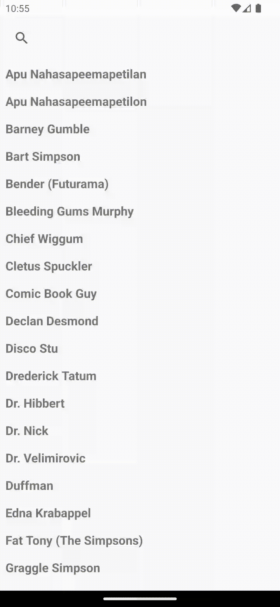

## Take Home Project

Created this project with Clean Architecture rules using MVVM + Repository design pattern with multiple data sources.
The App has two variants __Simpsons__ and __TheWire__ with different content based on the requirement.
Project is created using the android clean architecture guidelines.

### Project uses
- MVVM - Repository - DataSources Architecture
- Data binding
- View binding
- Dependency injection with Hilt
- ViewModel
- Kotlin Coroutines
- Room Databases
- LiveData | MediatorLiveData
- Unit tests for network layer

### External Libraries
- Retrofit
- Okhttp
- Glide
- mockk for mocking objects
- Mock Web Server

#### Simpsons UI (Phone + Tablet) ####

#### The Wire UI (Phone + Tablet) ####

